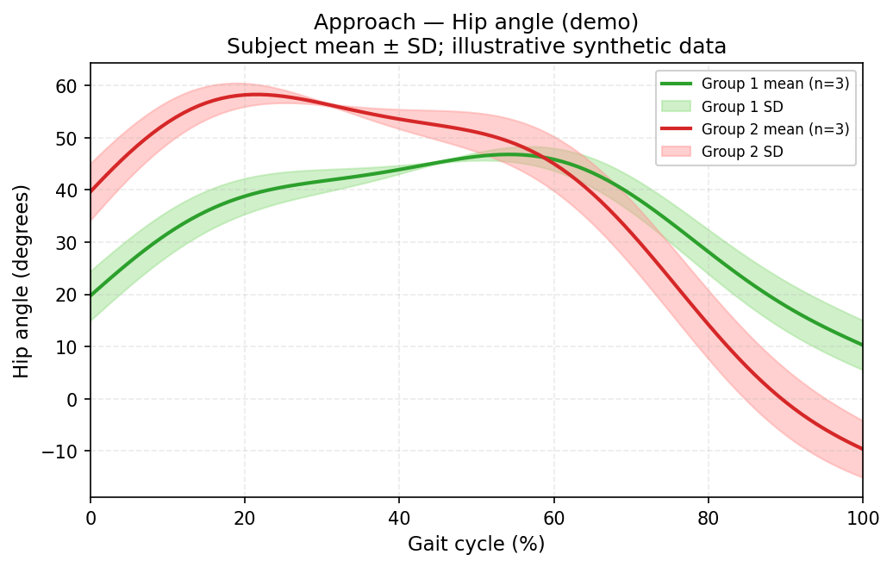
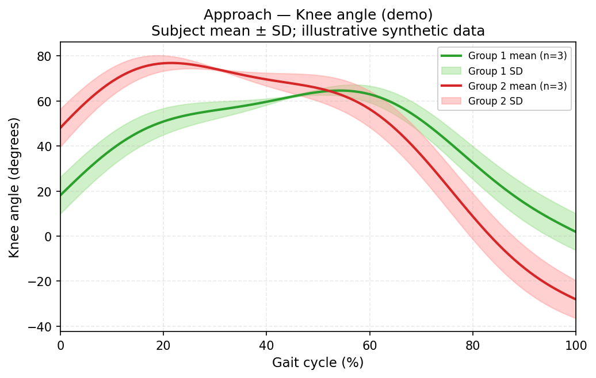
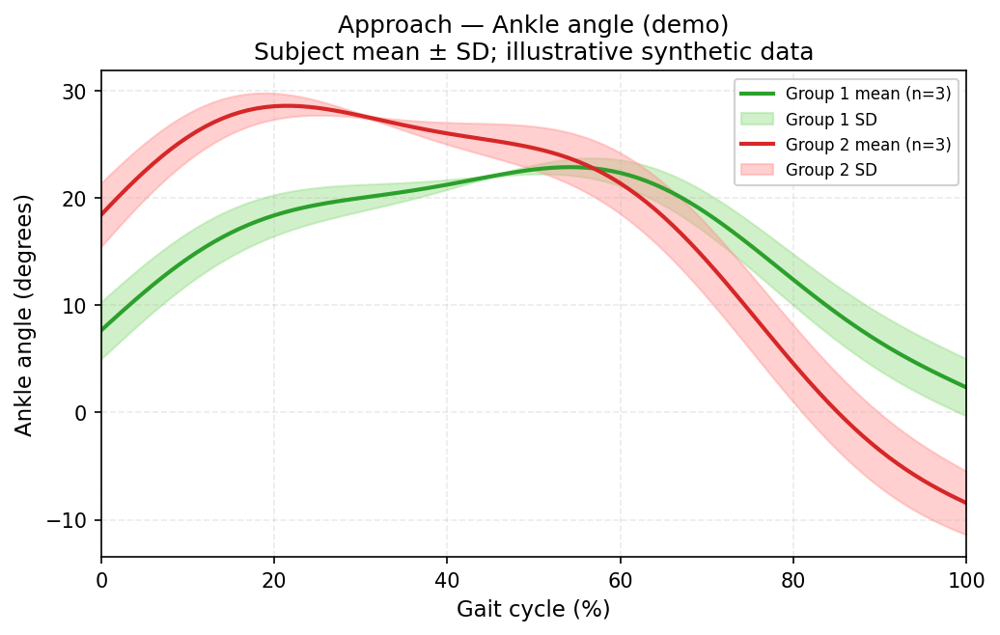

# Gait MoS & Kinematics

## Overview / Highlights

**Problem:** Spatiotemporal events alone do not answer **how** the body moved over the obstacle—cohorts need **phase-aligned joint kinematics** (hip/knee/ankle) and **margin of stability (MoS)** on comparable time bases across strides, groups, and obstacle conditions.

**Highlights:** Batch pipelines from gap-filled PiG CSVs + `per_stride_data.csv`: **sagittal joint angles** with ensemble mean±SD curves (SPM-style 0–100% gait cycle), **per-stride peak extraction**, and **MoS** (discrete summaries and time series). Handles manifest path variants, 0-based stride frame indices, and portable CLIs for the kinematics/MoS stage after [marker-label](https://github.com/yesiam0225/marker-label) and [gait-spatiotemporal](https://github.com/yesiam0225/gait-spatiotemporal).

## Installation

```bash
git clone https://github.com/yesiam0225/gait-mos-kinematics.git
cd gait-mos-kinematics
pip install -e .
```

This installs the `gait_mos_kinematics` package and five CLI commands (`batch-kinematics-ensemble`, `batch-kinematics-peaks`, `batch-mos`, `batch-mos-timeseries`, `plot-ensemble-kinematics`).

## Requirements

- Python 3.10+
- NumPy, pandas

## Input data

Batch scripts expect:

| File | Description |
|------|-------------|
| `obs_trials.csv` | Trial manifest: `subject_id`, `trial`, `group`, `board`, `time`, `csv_path`, `leg_length_mm`, `height_mm`, … |
| `per_stride_data.csv` | Per-stride events from spatiotemporal pipeline: `hs_start_frame`, `hs_end_frame`, `to_frame`, `phase`, `side`, `step_length_mm`, … |
| Corrected marker CSVs | Full-body PiG marker trials (mm, 100 Hz) referenced by `csv_path` |

Trial CSV paths in the manifest may use spaces (`SUBJ01 Trial 05_corrected.csv`) or underscores; the batch scripts resolve multiple naming conventions automatically.

Frame indices in `per_stride_data.csv` (`hs_start_frame`, `hs_end_frame`, `to_frame`, …) are **0-based row indices** into the trial CSV referenced by `csv_path`.

## End-to-end pipeline

This repo is the **kinematics + MoS stage** after [gait-spatiotemporal](https://github.com/yesiam0225/gait-spatiotemporal) and [marker-label](https://github.com/yesiam0225/marker-label):

```text
marker-label (gap-filled CSV + manifest)
    → gait-spatiotemporal (per_stride_data.csv, per_step_data.csv)
    → gait-mos-kinematics (this repo: ensemble, peaks, MoS)
```

[marker-label](https://github.com/yesiam0225/marker-label) also ships an in-repo **`gait_analysis/`** module with the same MoS/kinematics batch scripts plus `visualize_mos.py` QC plots. Use **this package** for portable installs and joint peak CSVs; use marker-label `gait_analysis/` when you want MoS figure batching in the same repo as corrected trials.

### Main cohort example

```bash
# After spatiotemporal-gait on corrected/obs_trials_gap_filled.csv
batch-kinematics-ensemble \
  --obs-csv corrected/obs_trials_gap_filled.csv \
  --ps-csv gait_spatiotemporal_out/per_stride_data.csv \
  --trial-dir corrected/gap_filled_full_body \
  --output-dir output/gait_mos_kinematics/ensemble_curves

batch-kinematics-peaks \
  --obs-csv corrected/obs_trials_gap_filled.csv \
  --ps-csv gait_spatiotemporal_out/per_stride_data.csv \
  --trial-dir corrected/gap_filled_full_body \
  --output-dir output/gait_mos_kinematics/peaks

batch-mos \
  --obs-csv corrected/obs_trials_gap_filled.csv \
  --ps-csv gait_spatiotemporal_out/per_stride_data.csv \
  --trial-dir corrected/gap_filled_full_body \
  --output-dir output/gait_mos_kinematics/mos

batch-mos-timeseries \
  --obs-csv corrected/obs_trials_gap_filled.csv \
  --ps-csv gait_spatiotemporal_out/per_stride_data.csv \
  --trial-dir corrected/gap_filled_full_body \
  --output-dir output/gait_mos_kinematics/mos_timeseries
```

### Extra / added cohort example

Additional gap-filled trials (manifest `corrected/added/extra_obs_trials.csv`, spatiotemporal output under `gait_spatiotemporal_out/extra/`):

```bash
batch-kinematics-peaks \
  --obs-csv corrected/added/extra_obs_trials.csv \
  --ps-csv gait_spatiotemporal_out/extra/per_stride_data.csv \
  --trial-dir . \
  --output-dir output/gait_mos_kinematics_extra/peaks

batch-kinematics-ensemble \
  --obs-csv corrected/added/extra_obs_trials.csv \
  --ps-csv gait_spatiotemporal_out/extra/per_stride_data.csv \
  --trial-dir . \
  --output-dir output/gait_mos_kinematics_extra/ensemble_curves
# also writes output/gait_mos_kinematics_extra/peaks/peaks_per_stride.csv
```

## Command-line tools

### Joint kinematics ensemble (SPM)

Time-normalizes hip/knee/ankle angle, velocity, and acceleration per stride, then averages within each subject × condition × phase × side cell. Writes 36 wide-format CSVs (`ensemble_<phase>_<joint>_<signal>.csv`).

```bash
batch-kinematics-ensemble \
  --obs-csv path/to/obs_trials.csv \
  --ps-csv path/to/per_stride_data.csv \
  --trial-dir path/to/corrected/ \
  --output-dir path/to/output/ensemble_curves/
```

Optional: `--filter-trials SUBJ01:5,SUBJ01:23` to process a subset.

Also writes **`../peaks/peaks_per_stride.csv`** and **`peaks_subject_condition.csv`** relative to `--output-dir` (e.g. `ensemble_curves/` → sibling `peaks/`). These peaks include tier-2 Mahalanobis outlier rejection when enabled via CLI flags.

**Portfolio example** (synthetic `Group 1` / `Group 2` demo curves):

| Hip | Knee | Ankle |
|-----|------|-------|
|  |  |  |

*Illustrative approach-phase angle ensembles (mean ± 1 SD); no participant data.*

Regenerate: `python examples/generate_demo_ensemble_plots.py` (see [examples/README.md](examples/README.md)).

### Joint angle peaks (discrete outcomes)

Per-stride max/min angle peaks and gait-cycle timing (`*_peak_flexion`, `*_peak_extension`, `*_pct`, `*_rom`):

```bash
batch-kinematics-peaks \
  --obs-csv path/to/obs_trials_gap_filled.csv \
  --ps-csv path/to/per_stride_data.csv \
  --trial-dir path/to/marker-label/ \
  --output-dir path/to/output/peaks/
```

Outputs: `kinematics_all_strides.csv`, `kinematics_subject_condition.csv`. Use this when you want peaks only (no ensemble CSVs). For ensemble + filtered peaks in one run, prefer **`batch-kinematics-ensemble`** above.

### Ensemble plots (mean ± SD)

One PNG per ensemble CSV (solid mean, shaded ±1 SD across subjects):

```bash
plot-ensemble-kinematics \
  --ensemble-dir path/to/output/ensemble_curves/ \
  --output-dir path/to/output/ensemble_plots/ \
  --group-cols board,time
```

Optional: `--by-side-plots` for separate left/right figures.

### MoS at gait events

Computes whole-body COM, XCOM, and MoS at heel strike, mid-swing, and foot-off. Outputs:

- `mos_all_strides.csv` — one row per stride
- `mos_subject_condition.csv` — subject × condition × phase means

```bash
batch-mos \
  --obs-csv path/to/obs_trials.csv \
  --ps-csv path/to/per_stride_data.csv \
  --trial-dir path/to/corrected/ \
  --output-dir path/to/output/mos/
```

### MoS time-series ensemble (SPM)

Frame-wise MoS_AP and MoS_ML curves time-normalized to 0–100%, ensemble-averaged per cell. Writes `ensemble_mos_<phase>_<direction>[_normheight].csv`.

```bash
batch-mos-timeseries \
  --obs-csv path/to/obs_trials.csv \
  --ps-csv path/to/per_stride_data.csv \
  --trial-dir path/to/corrected/ \
  --output-dir path/to/output/mos_timeseries/
```

### MoS clearance (Beerse et al.)

`batch-mos` adds clearance columns derived from spatiotemporal step parameters at heel strike:

- **AP clearance** = `step_length_mm − mos_ap_HS` (positive → foot anterior to extrapolated COM)
- **ML clearance** = `step_width_mm − mos_ml_HS`

NaN when `step_length_mm` / `step_width_mm` is NaN (e.g. first IC in trial has no prior opposite-foot contact in `per_step_data.csv`).

## Python API

```python
from gait_mos_kinematics import process_trial, process_trial_mos
import pandas as pd

strides = pd.read_csv("per_stride_data.csv")

summary, curves = process_trial(
    "SUBJ01_Trial_05_corrected.csv",
    strides,
    subject_id="SUBJ01",
    trial=5,
    leg_length_mm=850.0,
)

mos_df = process_trial_mos(
    "SUBJ01_Trial_05_corrected.csv",
    strides,
    subject_id="SUBJ01",
    trial=5,
    leg_length_mm=850.0,
    height_mm=1700.0,
)
```

## Modules

| Module | Role |
|--------|------|
| `gait_kinematics.py` | Newington-Gage HJC, sagittal joint angles/derivatives, time normalization |
| `gait_mos.py` | Dempster whole-body COM, XCOM, MoS, clearance, crossing speed |
| `batch_kinematics_ensemble.py` | Batch kinematics → SPM ensemble CSVs |
| `batch_mos.py` | Batch discrete-event MoS |
| `batch_mos_timeseries.py` | Batch MoS time-series → SPM ensemble CSVs |

## Related projects

| Repository | Role |
|------------|------|
| [marker-label](https://github.com/yesiam0225/marker-label) | Marker labeling, gap fill, trial manifests, in-repo `gait_analysis/` MoS QC |
| [gait-spatiotemporal](https://github.com/yesiam0225/gait-spatiotemporal) | IC/TO detection → `per_stride_data.csv`, `per_step_data.csv` |

Full batch workflow and output layout: [marker-label — Downstream gait analysis](https://github.com/yesiam0225/marker-label#downstream-gait-analysis).

## License

MIT — see [LICENSE](LICENSE).
